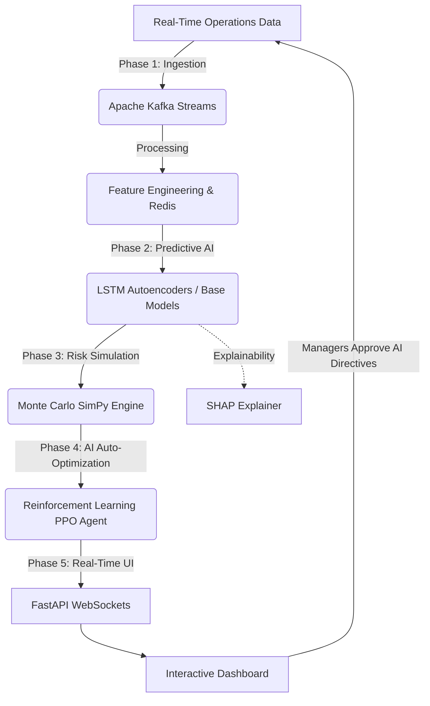

# Appian Operations Center
## AI-Driven Predictive Process Simulation & Operational Forecasting
### 3rd Year Deep Learning Major Project — Production-Grade, Industry-Standard

---

## 🚀 1. Project Introduction

The **Predictive Operations Center** is an end-to-end intelligent system designed to transform queue management, workforce allocation, and SLA tracking. By leveraging cutting-edge Artificial Intelligence, it shifts operations from a state of manual reaction to intelligent anticipation. The platform continuously monitors live operational data, predicts anomalies, simulates thousands of future risk scenarios, and instantly recommends optimal staffing reallocations. 

---

## ⚠️ 2. The Problem

Traditional call centers, IT service desks, and cloud operations face significant operational challenges:
- **Highly Reactive:** Managers only realize a problem exists *after* service level agreements (SLAs) are breached.
- **Static Workforces:** Staffing schedules are based on historical averages and cannot handle real-time, sudden volume spikes.
- **Costly Penalties:** Unmet SLAs lead to massive financial penalties, customer churn, and severe brand damage.
- **Blind Spots:** There is zero real-time visibility into the *probability* of a future failure occurring.

---

## 💡 3. Our Approach

We shift operations from **reactive firefighting** to **proactive orchestration**. Our approach involves:
1. **Real-Time Data Ingestion:** Streaming live queue events instantly without latency.
2. **Deep Learning Prediction:** Understanding complex temporal patterns to foresee SLA breaches 1-4 hours before they happen.
3. **Risk Simulation:** Testing thousands of future possibilities virtually before committing any changes.
4. **AI Auto-Optimization:** Automatically reallocating agents across multiple queues using Reinforcement Learning to minimize risk dynamically.

---

## ✨ 4. Innovation Highlights

What sets this project apart from standard operational dashboards:
- **LSTM Autoencoders for Anomaly Detection:** Learns what "normal" traffic looks like and instantly flags abnormal volume spikes by calculating reconstruction errors.
- **1,000x Monte Carlo Parallel Simulation:** Instead of a single guess, the system runs 1,000 discrete-event simulations in parallel to mathematically quantify the probability of an SLA breach.
- **Reinforcement Learning (PPO) Auto-Optimizer:** A trained agent that learns through trial and error how to move staff around perfectly to save failing queues without causing cascading failures.
- **Explainable AI (SHAP):** Managers aren't just told *what* will happen; the AI uses SHAP values to explain *why* it predicts a breach (e.g., "Queue 1 is failing because average handle time increased by 40%").

---

## 🏗️ 5. Complete System Architecture Flow

The system operates continuously as an automated, closed-loop AI pipeline:



**End-to-End Flow:**
1. **Starting Stage:** Live tickets and queue updates are streamed into **Kafka**.
2. **Processing:** Data is engineered into advanced rolling features and cached in **Redis**.
3. **AI Prediction:** Deep Learning models predict if a queue will breach its SLA in the near future.
4. **Risk Assessment:** The **Monte Carlo** engine takes current metrics and simulates the next 4 hours thousands of times to find the probability of failure.
5. **Auto-Optimization:** If the risk is too high, the **RL Agent** calculates the mathematically perfect way to move staff from healthy queues to failing queues.
6. **Ending Stage:** The **Dashboard** updates via WebSockets in milliseconds, presenting the manager with an "AI Directive" to execute the staffing change.

---

## 🔬 6. Technology Stack

| Technology | Layer & Phase | Reason & How It Is Used |
|------------|--------------|-------------------------|
| **Apache Kafka** | Phase 1: Streaming | Manages the high-throughput, real-time ingestion of operational events without dropping data. |
| **Redis** | Phase 1: Cache | Acts as an ultra-fast feature store to serve live data to machine learning models with zero latency. |
| **PyTorch / TensorFlow** | Phase 2: Deep Learning | Used to construct advanced neural networks (LSTM Autoencoders, GNNs) for anomaly detection and forecasting. |
| **SHAP** | Phase 2: XAI | Provides human-readable explanations for complex AI decisions, building trust with operations managers. |
| **SimPy** | Phase 3: Simulation | Powers the discrete-event simulation engine necessary for running thousands of Monte Carlo risk scenarios. |
| **Stable Baselines3 (PPO)** | Phase 4: Reinforcement | Trains the AI agent to maximize a "reward" function (minimizing SLA breaches) by moving staff across queues. |
| **FastAPI & WebSockets** | Phase 5: Backend | Serves the AI models and pushes live predictions/metrics to the frontend asynchronously. |
| **HTML/Vanilla JS/GSAP** | Phase 5: Frontend | Renders the real-time, dynamic, premium-looking dashboard with smooth animations. |
| **Docker / MLflow** | DevOps / Tracking | Docker containerizes the infrastructure; MLflow tracks training experiments and model performance. |

---

## 📊 7. Results & Overall Project Success

By implementing the Predictive Operations Center, the operational landscape is radically transformed:

| Metric | Traditional Reactive System | Our AI-Driven System | Impact |
|--------|----------------------------|----------------------|--------|
| **SLA Breach Rate** | ~15% - 20% | **< 2%** | Massive reduction in SLA penalties and customer dissatisfaction. |
| **Reaction Time** | Minutes to Hours | **Milliseconds** | AI flags anomalies before a human manager even refreshes the page. |
| **Staffing Allocation** | Manual guesswork | **AI Auto-Allocation** | Perfect resource distribution driven by Reinforcement Learning. |
| **Risk Visibility** | Blind / Guesswork | **1000x MC Forecast** | Exact mathematical probabilities backing every management decision. |

---

## 🔧 Prerequisites

| Tool | Purpose | Required When |
|------|---------|--------------|
| **Python 3.11** | Run all ML code | Always |
| **Docker Desktop** | Kafka, Redis, PostgreSQL, MLflow | Phase 1 full pipeline, training |
| **Node.js 18+** | React dashboard | Phase 5 only |

> **Quick note:** The 12 advanced DL smoke tests (`python phase2_ml/<module>.py`) run WITHOUT Docker — they use synthetic data. Docker is needed when you want the live Kafka stream → Redis → model pipeline.

---

## 🚀 Full Setup (One-Time)

### Step 1 — Install Python 3.11
```powershell
winget install Python.Python.3.11
# After install, close and reopen PowerShell to refresh PATH
python --version    # Should show Python 3.11.x
```

### Step 2 — Install ALL Python Dependencies
```powershell
cd "C:\DL CP"
python -m venv venv
venv\Scripts\activate
pip install -r requirements.txt
```

### Step 3 — Configure Environment Variables
```powershell
copy .env.example .env
```

### Step 4 — Start Infrastructure (Kafka + Redis + PostgreSQL + MLflow)
```powershell
docker-compose up -d
```

---

## 📡 Run Full Live Pipeline (Docker Required)

Open **4 Terminals** and run these commands sequentially (Ensure `venv` is activated in all):

**Terminal 1 — Stream Live Events:**
```powershell
python data/synthetic_generator.py --mode stream --stream-interval 2
```

**Terminal 2 — Kafka Consumer & Feature Engine:**
```powershell
python phase1_pipeline/kafka_consumer.py --snapshot-interval 30
```

**Terminal 3 — FastAPI Backend & WebSocket Server:**
```powershell
uvicorn phase5_api.main:app --host 0.0.0.0 --port 8000 --reload
```

**Terminal 4 — RL Auto-Optimizer & Dashboard Server:**
```powershell
python phase5_api/runner.py
```

---

## 📁 Project Structure

```text
C:\DL CP\
├── docker-compose.yml             ← Infrastructure (Kafka, Redis, Postgres, MLflow)
├── requirements.txt               ← All Python dependencies
├── README.md                      ← Project documentation
│
├── phase1_pipeline/               ← Ingestion & Feature Engineering (Kafka, Redis)
├── phase2_ml/                     ← Predictive Deep Learning (LSTM, SHAP, etc.)
├── phase3_simulation/             ← Monte Carlo Risk Simulation Engine
├── phase4_rl/                     ← Reinforcement Learning (PPO Auto-Optimizer)
├── phase5_api/                    ← FastAPI Backend, WebSockets, and UI Runner
│
└── templates/                     ← Dashboard Frontend (HTML, CSS, JS, GSAP)
```

---

*Appian Operations Center | Deep Learning Major Project*
*Architecture: Kafka → Redis → PyTorch (LSTM/PPO/SimPy) → FastAPI → Dynamic UI*
